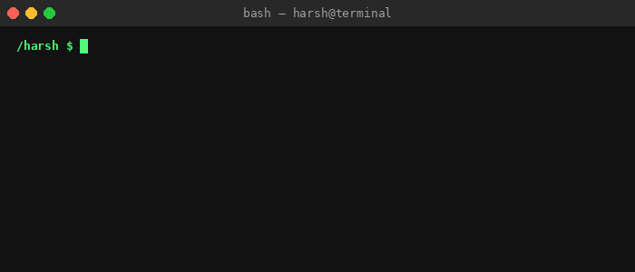

<!--
    Hey there, I'm Harsh Mahajan!
    Happy to see you here exploring my README code.
    Feel free to inspire!

    But may I please ask you to follow me in return? Just a click!
    You may also want to connect with me on LinkedIn @harsh101011 :))
-->

<!--
    Terminal GIF created with Python + Pillow
-->

    

---

### 🛠️ Main Skills

---

### 📖 Currently Learning

---

### 🏅 Certifications

- **AWS Academy Cloud Foundations**
- **AWS Academy Cloud Architecting**
- **IBM DevOps Fundamentals**
- **OCI DevOps Professional**

---

### 🚀 Featured Projects

**[Acquisitions — SaaS Business Marketplace API](https://github.com/Harsh101011)**
> Node.js · PostgreSQL · Docker · Kubernetes · GitHub Actions · Jest
- JWT auth with RBAC for multi-role workflows (buyers, sellers, admins)
- Full CI/CD pipeline with automated linting, testing & deployments
- Horizontal scaling via Kubernetes for high availability

**[AutoDeploy — Automated Web Deployment Pipeline](https://github.com/Harsh101011)**
> Python · Docker · Docker Compose · Jenkins · AWS EC2 · MySQL
- Commit-triggered Jenkins + GitHub pipeline: code push → live on EC2, zero manual steps
- Dockerized Flask + MySQL stack for identical local & production environments

---

### 🤝 Connect with me!

    
    &nbsp;
    
    &nbsp;
    

---

### 👔 Employer?

> [!IMPORTANT]
> <a href="https://github.com/Harsh101011" download>Download my resume</a>

<!--
    Thanks for stopping by! ♟
-->
